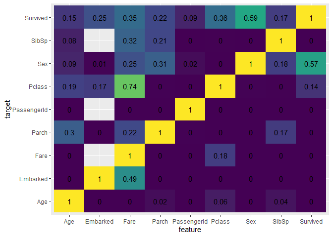

<!-- README.md is generated from README.Rmd. Please edit that file -->

# ppscore - a R implementation of the Predictive Power Score (PPS)

<!-- badges: start -->

<!-- badges: end -->

This in R port of the Predictive Power Score (PPS) developed by
[8080Labs](https://github.com/8080labs/ppscore) for Python and described
on the blog post [Toward Data
Science](https://towardsdatascience.com/rip-correlation-introducing-the-predictive-power-score-3d90808b9598?gi=ba32980cd4d4).

As of June, 8080Labs developed an R version,
[PPScoreR](https://github.com/8080labs/ppscoreR) which will likely be
better maintained then this will…. so go use that.

This is also my first attempt at building a package… mostly for fun.

## Installation

You can install via:

``` r
remotes::install_github("jlawren67/ppscore")
```

## PPScore

The `ppscore` function returns the Predictive Power Score for any target
and feature. The score represents how well the feature explains the
target.

``` r
library(ppscore)
## basic example code

titanic <- read.csv('https://raw.githubusercontent.com/8080labs/ppscore/master/examples/titanic.csv', stringsAsFactors = F)

ppscore(titanic, "Survived", "Sex")
#>     target feature      task_name  ppscore metric baseline_score model_score
#> 1 Survived     Sex classification 0.595055     f1      0.4698232   0.7853076
```

## pps\_matrix

To run comparisons on all variables in the data.frame, use the
`pps_matrix` function. This will run all possible target/feature
combinations and return in a long-format data frame.

``` r
mtx_check <- pps_matrix(titanic)
```

The PPS Matrix can then be generated by:

``` r
mtx_check %>%
  filter(task_name %in% c('predict_itself', 'classification', 'regression')) %>%
  add_count(target, name = "appearance") %>%
  filter(appearance > 1) %>%
ggplot(aes(x = feature, y = target, fill = ppscore)) +
  geom_tile() +
  geom_text(aes(label = ppscore %>% round(2))) +
  scale_fill_viridis_c(guide = F)
```


